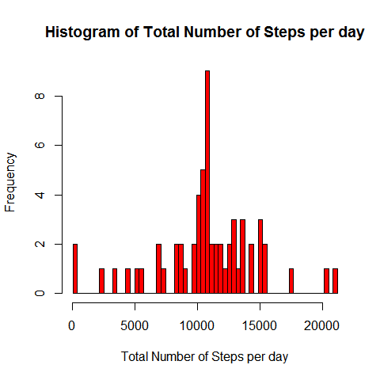
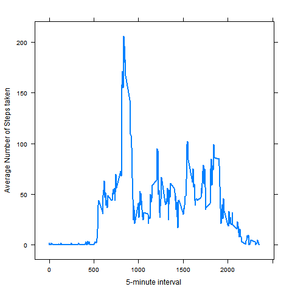
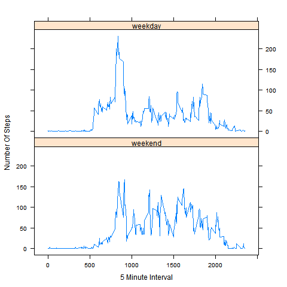

## Loading and preprocessing the data


```r
unzip("activity.zip")
datain <- read.csv("activity.csv",header=T,stringsAsFactors = F)
datain$date <- as.Date(datain$date,"%Y-%m-%d")
Log <- is.na(datain$steps)
datain0 <- datain[!Log,]
```

## What is mean total number of steps taken per day?


```r
library(dplyr)
datain1 <- datain0 %>% group_by(date) %>% summarize(steps=sum(steps))
datain1$steps <- round(datain1$steps,digits=0)
data <- datain1$steps
hist(data,breaks = seq(min(data),max(data),by=((max(data) - min(data))/(length(data)-1))),
     xlab="Total Number of Steps per day",
     main="Histogram of Total Number of Steps per day",col="red")
```

 

```r
round(mean(data,na.rm=T),digits=0)
```

```
## [1] 10766
```

```r
median(data,na.rm=T)
```

```
## [1] 10765
```

## What is the average daily activity pattern?

```r
library(lattice)
datain2 <- datain0 %>% group_by(interval) %>% summarize(steps=mean(steps))
xyplot(steps ~ interval,data=datain2,type="l",lwd="2",xlab="5-minute interval",
       ylab="Average Number of Steps taken")
```

 

```r
datain2$steps <- round(datain2$steps,digits=0)
maxInter <- datain2[which.max(datain2$steps),]
maxInter$interval
```

```
## [1] 835
```

## Imputing missing values

```r
a <- datain[!complete.cases(datain),]
nrow(a)
```

```
## [1] 2304
```

```r
datain$steps <- as.numeric(datain$steps)
datain4 <- datain0 %>% group_by(interval) %>% summarize(steps=mean(steps))
datain4$steps <- round(datain4$steps,digits = 0)

stepVec <- as.numeric()
for(i in 1:nrow(datain)) {
        if(is.na(datain[i,1])) {
                inter <- datain[i,3]
                a1 <- datain4[datain4$interval==inter,]
                b <- a1$steps   
        }
        else{
                b <- datain[i,1]      
        }

        stepVec = c(stepVec,b)
}
datain41 <- data.frame(datain)
datain41 <- datain41[-1]
datain41$steps <- stepVec

datain5 <- datain41 %>% group_by(date) %>% summarize(steps1=sum(steps))
data <- datain5$steps
hist(data,breaks = seq(min(data),max(data),by=((max(data) - min(data))/(length(data)-1))),
     xlab="Total Number of Steps per day",
     main="Histogram of Total Number of Steps per day",col="red")
```

 

```r
round(mean(data,na.rm=T),digits=0)
```

```
## [1] 10766
```

```r
median(data,na.rm=T)
```

```
## [1] 10762
```
### There is no impact on the mean and median of the total daily number of steps taken per day among removing missing data and after imputing missing data.

## Are there differences in activity patterns between weekdays and weekends?

```r
datain41$days <- weekdays(datain41$date)
wkdays <- c('Monday','Tuesday','Wednesday','Thursday','Friday')
datain41$day <- factor(datain41$days %in% wkdays,levels=c(F,T),labels=c("weekend","weekday"))
datain42 <- datain41 %>% group_by(interval,day) %>% summarize(steps=mean(steps))

xyplot(steps ~ interval|day,data=datain42,type="l",xlab="5 Minute Interval",lwd=1,
       ylab="Number Of Steps",layout=c(1,2))
```

 

### The mean and median of Number of Steps taken on weekdays is higher when compared to weekends.
